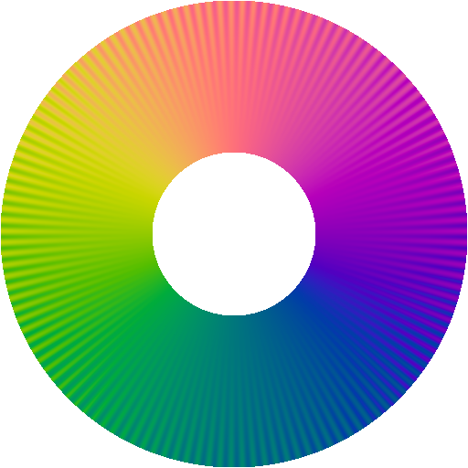
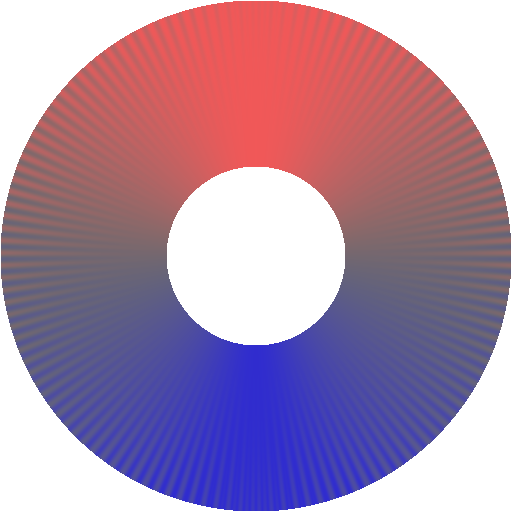

# UniformBicone

Perceptually uniform color maps

### Introduction
This library contains c++ implementations of perceptually uniform color maps for ramps, cycles, disks, spheres, and balls with a python wrapper module. Ramp and cycle color maps are based on the excellent paper:

[Kovesi, Peter. "Good colour maps: How to design them." arXiv:1509.03700 [cs.GR] 2015 (2015).](https://peterkovesi.com/projects/colourmaps/)

Disk, sphere, and ball color maps are based on:

[submitted paper](link to paper)

### Colormaps

##### Ramps
|Name |Legend |
|:---:|:---:|
|gray | |
|fire | |
|ocean||
|ice  |  |
|div  |  |

##### Cyclic
|Name |Legend |
|:---:|:---:|
|gray ||
|four ||
|six  | |
|div  | |

##### Disk
|Name |Legend | Legend (white center) |
|:---:|:---:|:---:|
|four |||
|six  | | |

### Inversion Symmetry / Periodic Boundaries
Inversion symmetry for sphere / ball maps can be achieved by either doubling the polar or azimuthal angle. Either can be applied to disk maps, but polar doubling only provides periodic boundaires for the disk, not inversion symmetry.

|Polar Angle |Azimuthal Angle |
|:---:|:---:|
| | |